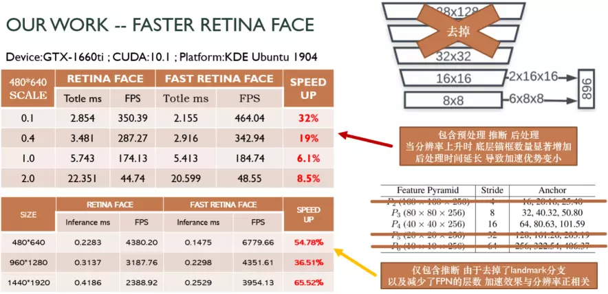
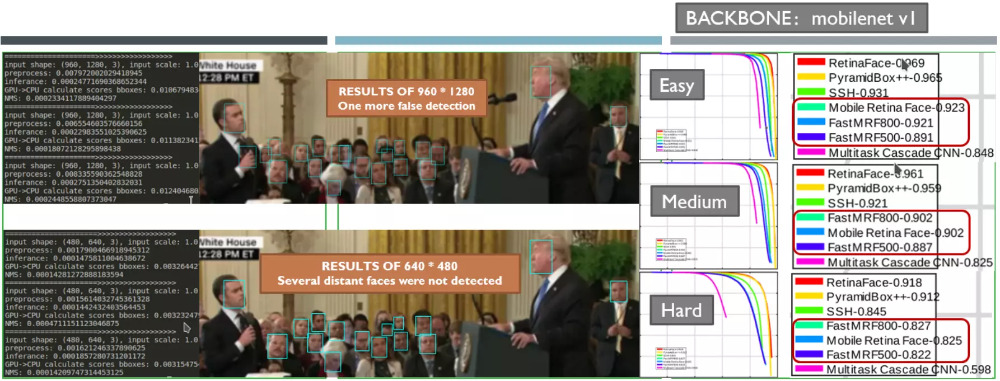

# Face Detection @ 500-1000 FPS
Reimplementation of retinaface, faster and stronger.


## Getting Start

* [Install gstreamer for reading videos](https://gstreamer.freedesktop.org/documentation/installing/on-linux.html?gi-language=c)
    
    ```shell
    sudo apt-get install libgstreamer1.0-0 gstreamer1.0-plugins-base gstreamer1.0-plugins-good gstreamer1.0-plugins-bad gstreamer1.0-plugins-ugly gstreamer1.0-libav gstreamer1.0-doc gstreamer1.0-tools gstreamer1.0-x gstreamer1.0-alsa gstreamer1.0-gl gstreamer1.0-gtk3 gstreamer1.0-qt5 gstreamer1.0-pulseaudio
    ```

<!-- * Make Cython nms, anchors, etc
    ```shell
    cd rcnn && make && cd ..
    ``` -->

* Testing on usb camera 0  &nbsp; (**Be Careful About `!` and `|`**)

    ```shell
    gst-launch-1.0 -q v4l2src device=/dev/video0 ! video/x-raw, width=640, height=480 ! videoconvert ! video/x-raw, format=BGR ! fdsink | python3 face_detector.py
    ```

## PR on wilder face test dataset



## Speed on GTX1660ti and Jetson-nano

* Why use Faster-RetinaFace ?

    | Plan | Inference | Postprocess | Throughput Capacity (FPS)
    | --------|-----|--------|---------
    | 9750HQ+1660TI | 0.9ms | 1.5ms | 500~1000
    | Jetson-Nano | 4.6ms | 11.4ms | 80~200
    
    If the queue is bigger enough, the throughput capacity can reach the highest.

## Citation

```
@inproceedings{deng2019retinaface,
title={RetinaFace: Single-stage Dense Face Localisation in the Wild},
author={Deng, Jiankang and Guo, Jia and Yuxiang, Zhou and Jinke Yu and Irene Kotsia and Zafeiriou, Stefanos},
booktitle={arxiv},
year={2019}
}
```